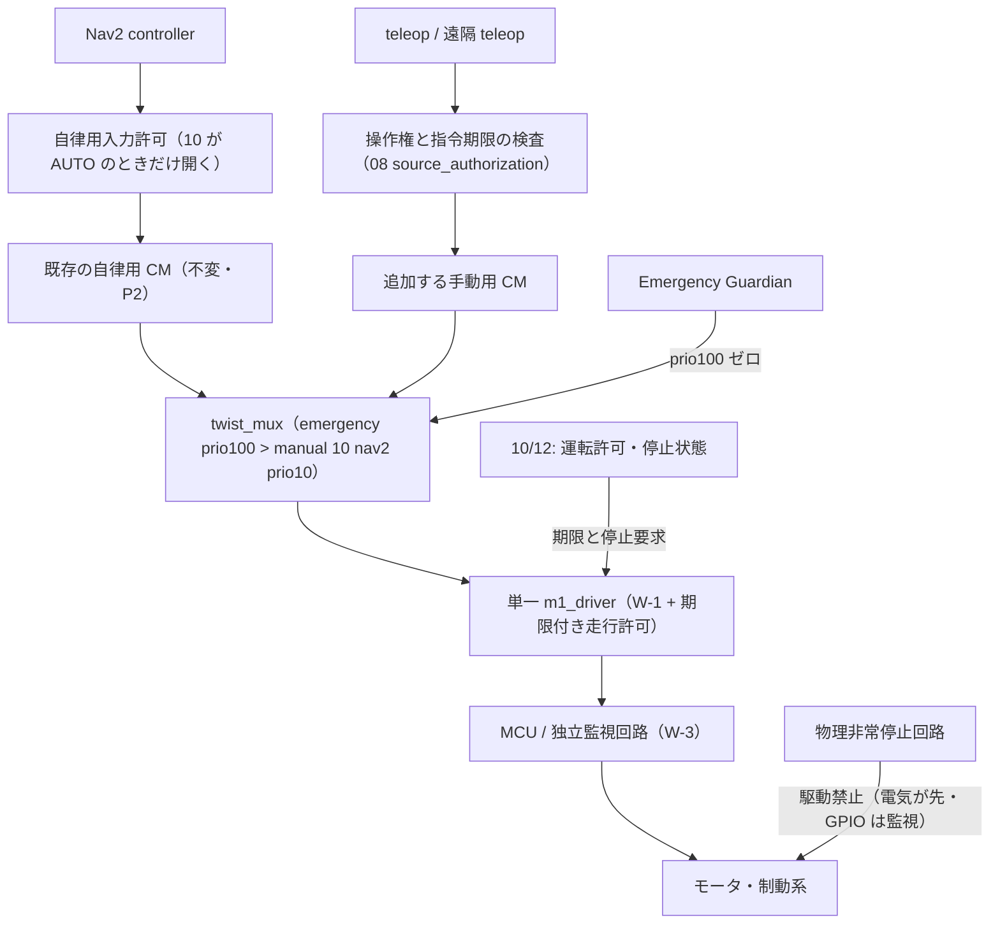

# 09 — 外部レビュー v3（2026-09-14）への応答: 一次情報照合・v2.1 契約修正・確認実装の再整理

作成日: 2026-09-14
Status: **提案（裁定待ち = `OQ-OD88`〜`OQ-OD97`）**。外部レビュー v3（「ROSMASTER M1 屋外化：設計レビューとディレクトリー設計 v3案」2026-09-14。対象は [08](08-architecture-v2-reference-alignment.md) の v2 分解と 02〜07）を、エージェントチーム 4 レーン（A1 = Nav2 humble 上流ソース／A2 = 外部製品・法規の一次情報／B = 自 docs の記述照合／C = 自 code の配線照合）で検証し統合した。外部一次情報は URL + 参照日 2026-09-14、repo の pin は執筆時に実 Read（[D]=一次情報/実ファイル確認・[L]=レーン報告で URL あり（執筆者未再読）・[I]=推論）。**本 doc は 08 の v2 分解を置換しない**。12 区分は維持し（レビューも「12区分は維持できる」と判定）、箱の**中の契約**を v2.1 として修正する。

> 正本ルート: [mode-outdoor/README](README.md)。前回照合 = [08 §4](08-architecture-v2-reference-alignment.md)。本 doc で訂正した自 docs の記述は各 doc に**同一行 or 末尾追補**で反映済（§1「反映先」列）。[06](06-hardware-delta-and-base-selection.md) / [07](07-drivetrain-and-wheel-sizing.md) は別セッションが同時編集中のため本 doc からは触らず、§6 に申し送りを置く。layer 注記は [08 §2](08-architecture-v2-reference-alignment.md) の L 軸列を正とし、ここでは再掲しない。

## 0. 要旨

1. **12 区分は維持**。v2 → **v2.1** で変えるのは箱の切り方ではなく契約: (a) 走行許可を**期限付き契約**にする（既存 `/bot{n}/stop_state` の additive 拡張＝§2-a）(b) X2 の**センサ鮮度監視 → 09 の許可失効**（§2-b）(c) 手動・遠隔経路にも CM（§2-c）(d) 制御と映像の**接続分離**（§2-d）(e) 運転状態 7 状態・横断 5 状態（§2-e / §2-f）(f) 停止の 3 分離と**停止距離式で期限を決める**（§2-g）(g) 地図 4 用途・terrain 契約・skid-steer 契約（§2-h / i / j）(h) `00_Platform_Contract` を前提箱として追加（§2-l）。
2. **我々の誤りを 4 件訂正**（§1 #1・#14・#15・#21）。最重要は **Humble の `nav2_collision_monitor` は per-source `source_timeout` を読まず、途絶した source は点が消えるだけで止まらない（fail-open）** [D]。08 の「per-source timeout」、[`collision_monitor.yaml:58`](../../ws/src/warehouse_bringup/config/collision_monitor.yaml:58) / [`:90`](../../ws/src/warehouse_bringup/config/collision_monitor.yaml:90) のコメント（Jazzy 意味論）、[doc12:546](../architecture/12-infrastructure-common.md:546) の「`source_timeout` = `/scan` 鮮度 → 物理停止」は **Humble（[ADR-0008](../adr/0008-ros2-distro-humble-for-rosmaster-m1.md)）では成立しない**。センサ途絶で止める責務は CM の外（X2 → 走行許可失効）に置く（[doc12 末尾追補](../architecture/12-infrastructure-common.md)）。
3. **cuVSLAM の blocker を再訂正**: Isaac ROS 3.2 は **ROS 2 Humble + JetPack 6.1 / 6.2 + Jetson Orin が公式対象** [D]（Orin Nano は 4GB 版のみ非推奨）。前回（2026-09-12）「[ADR-0008](../adr/0008-ros2-distro-humble-for-rosmaster-m1.md) の Humble pin が真の blocker」と直したのは誤り。残る理由は HP60C にステレオ IR が無いこと（ハード・不変）と、OAK-D 等を足す場合のカメラ同期要件（30 Hz・jitter ±2 ms・ステレオ間 ±100 µs）・資源・検証負荷。[doc23:804](../architecture/23-perception-and-localization.md:804) を同一行で再訂正。
4. **`speed_limit = 0.0` は「制限なし」**（Humble `NO_SPEED_LIMIT = 0.0`・MPPI は基準上限へ戻す [D]）。08 §3-4 の MRM-A 経路「帯 0」を撤回（[mode-m1/04:71](../mode-m1/04-runtime-speed-limiter.md:71) の罠と同じ）。
5. **レビュー側の誤読 8 件**（§6）: 03 は heading 収束前の発進禁止を既に要求／TF は「配信しない構成」と書いている／F9P が L6 を受けるとは書いていない／AMCL 除外の理由は「屋外だから」ではなく地図不在 + TF 二重配信／`elevation_mapping_cupy` は 2026-09-12 に一次情報で確認済／停止の同一視はしていない（ただし坂道保持は空白）／換装を k だけで吸収してはいない（MPPI `motion_model` の明記だけ欠落）／datum yaw はコード上 base_link の方位として注入される。
6. **ディレクトリー設計**（`bot1/00〜12` + `docs/bot1/` + `ws/src/bot1_*`）は責務ラベルとして採り、**配置は既存規約へ写像**（`docs/mode-outdoor/`・`warehouse_*` パッケージ・`warehouse_description` = 車体契約の家）。無理な 12 分割はしない（レビューも同旨）。§3。
7. **現行 code の事実**（レーン C・`origin/main` と同一ツリー）: twist_mux は `emergency`（prio100）/ `nav2`（prio10）の 2 入力のみで teleop 入力なし（[twist_mux.yaml:42-49](../../ws/src/warehouse_bringup/config/twist_mux.yaml:42)）・`teleop_joy` は `/bot1/cmd_vel` へ直接 publish（[teleop_joy.py:9](../../ws/src/warehouse_teleop/warehouse_teleop/teleop_joy.py:9)）。CM を通るのは controller だけで behavior_server は BYPASS（[nav2_bringup.launch.py:175](../../ws/src/warehouse_bringup/launch/nav2_bringup.launch.py:175)）。**期限付き走行許可は既に存在**（`/bot{n}/stop_state` の `valid_until`・[stop_state.py:5](../../ws/src/warehouse_m1_driver/warehouse_m1_driver/stop_state.py:5)・受信側上限 0.5 s [`:40`](../../ws/src/warehouse_m1_driver/warehouse_m1_driver/stop_state.py:40)・**既定 OFF** [driver_node.py:68](../../ws/src/warehouse_m1_driver/warehouse_m1_driver/driver_node.py:68)）。heartbeat・`MotionPermit`・`OperationMode`・`HeartBeat` 型は 0 件＝すべて additive。MPPI は既に `motion_model: "DiffDrive"`・`vy_max: 0.0`（[nav2_params.yaml:134](../../ws/src/warehouse_bringup/config/nav2_params.yaml:134) / [:124](../../ws/src/warehouse_bringup/config/nav2_params.yaml:124)）だが driver は `linear.y` を転送する（[driver_node.py:138](../../ws/src/warehouse_m1_driver/warehouse_m1_driver/driver_node.py:138)）。

## 1. 照合表（レビューの 27 主張 × 我々の記述 × 一次情報）

判定の語: **正**（主張が正しい）/ **部分的** / **不正確**（我々はそう書いていない）/ 補強（主張は正しく、根拠を足した）。「反映先」は本コミットで実施したもの。

| # | レビュー主張（要約） | 我々の記述（file:line） | 一次情報の判定 | 採否 | 反映先 |
|---|---|---|---|---|---|
| 1 P0 | Humble CM は `source_timeout` で止まらない・per-source 設定は無い・`stop_pub_timeout` 後に出力が消える | 08 §2 07 行・08 §5 停止行「per-source timeout」・[collision_monitor.yaml:58](../../ws/src/warehouse_bringup/config/collision_monitor.yaml:58) / [:90](../../ws/src/warehouse_bringup/config/collision_monitor.yaml:90)・[doc12:513](../architecture/12-infrastructure-common.md:513) / [:546](../architecture/12-infrastructure-common.md:546) | **正** [D]: humble `scan.cpp` `Scan::getData()` は `data_ == nullptr` / `!sourceValid()` で return（点を足さない）。`source.cpp` `getCommonParameters()` は `topic` / `enabled` のみ（per-source `source_timeout` は main 系）。`stop_pub_timeout`（yaml `:61` = 2.0 s）は**停止開始からの計時**で、経過後は障害物が残っていてもゼロ出力を止める | **採用（我々の誤り）** | 08 同一行 2 箇所・[04 §3](04-perception-sidewalk-and-signals.md) 注記・[05 末尾追補](05-safety-envelope-and-intervention.md)・[doc12 末尾追補](../architecture/12-infrastructure-common.md)・`OQ-OD95` / `96` |
| 2 P0 | STM32 に通信途絶停止が無いのに W-3 が後工程 | 08 §6 実装順に W-3 なし・[05:86](05-safety-envelope-and-intervention.md:86) `OQ-OD52`・[mode-m1/02:20-21](../mode-m1/02-m1-driver-and-watchdog.md:20)（FW に timeout / IWDG なし）| 正（事実は既知・順序表に無いのは事実） | 採用: 09 の下位停止（W-3 / 独立監視回路 / 期限付き許可）を**走行範囲拡大の前提**（順序 0）へ | 08 §6 行 0・05 末尾追補 4 |
| 3 P0 | 電源遮断・ゼロ Twist・実停止・坂道保持の同一視 | [05:42](05-safety-envelope-and-intervention.md:42)（latch 中 50 ms ゼロ）・[05:54](05-safety-envelope-and-intervention.md:54)（電源遮断が主）・[01:83](01-legal-envelope-japan.md:83)・[mode-m1/02:109](../mode-m1/02-m1-driver-and-watchdog.md:109)（短絡ブレーキ）＝分離済。**坂道保持は全 doc に無い** | 部分的（同一視はしていない・保持と惰走は空白） | 採用: 停止の 3 分離を語として導入・電源遮断後の惰走 / ずり下がり試験を追加 | 05 末尾追補 2・[GLOSSARY §12](../GLOSSARY.md)・`OQ-OD94` |
| 4 P0 | teleop が mux 直で自律用 CM を通らない | 08 §3-2「② teleop / 遠隔再生（external）」・tree html 08 行・現行 [twist_mux.yaml:42-49](../../ws/src/warehouse_bringup/config/twist_mux.yaml:42)（2 入力）・[teleop_joy.py:109](../../ws/src/warehouse_teleop/warehouse_teleop/teleop_joy.py:109)（`/bot1/cmd_vel` 直）| 正（設計・現行とも CM を通らない。OutdoorNav も teleop 時は衝突回避なし [D] だが、我々は遠隔者が視線外にいる前提なので採る）| 採用: 手動用 CM を追加（既存 CM は動かさない・10 が許可した 1 本のみ mux へ）| §2-c・tree / flow 同一行・`OQ-OD88` |
| 5 P0 | depth 禁止なのに depth 由来 cliff_scan | P1 原文 = [doc23:37](../architecture/23-perception-and-localization.md:37)「L1 に GPU 依存を持ち込まない」（depth 禁止ではない）・[04:66](04-perception-sidewalk-and-signals.md:66)・tree html 07 行「GPU/depth 禁止」は**誇張** | 部分的（tree の 1 行のみ誇張）| 採用: 語を修正・依存（カメラ・VPU・USB・時刻・外部パラメータ）を明記・全系を「pose 非依存」と呼ばず「**地図上の絶対位置に非依存**」| tree 同一行・08 §2 07 行・flow 同一行・04 末尾追補 |
| 6 P0 | 通常輪換装を車輪スケール k で吸収 | [07:110](07-drivetrain-and-wheel-sizing.md:110)（vy = 0 で差動一致）・07 追補③（`wheel_scale` / `yaw_scale`（実効輪距）/ `lateral_enabled` / 生カウント odom の 4 点）・[nav2_params.yaml:134](../../ws/src/warehouse_bringup/config/nav2_params.yaml:134) `DiffDrive`・[driver_node.py:138](../../ws/src/warehouse_m1_driver/warehouse_m1_driver/driver_node.py:138) は `linear.y` を転送 | 不正確（k だけではない）。欠落は MPPI `motion_model` の明記と driver の vy 拒否 | 採用（差分のみ）: §2-j | §2-j・07 は申し送り（§6）|
| 7 P1 | twist_mux を `vehicle_cmd_gate` 相当としている | 08 §3-2・tree html 対応表 | 正（gate の機能 [D] = 指令源選択 + heartbeat / timeout + 速度・加速度・操舵の制限 + engage + gate mode）| 採用: 「選択機能のみ相当」に改め gate 全体 = 08 + 09 + 10 + 12 | 08 / tree 同一行 |
| 8 P1 | 映像・制御・heartbeat が同一 WS チャネル | [02:76](02-architecture-split-orin-pc-cloud.md:76)・[02:27](02-architecture-split-orin-pc-cloud.md:27)・flow / tree html | 正 | 採用: 制御接続 / 映像接続 / 記録送信を分離・映像鮮度で遠隔速度上限 | 02:76 同一行・[02:106](02-architecture-split-orin-pc-cloud.md:106)・`OQ-OD90` |
| 9 P1 | datum があるので初期の絶対方位も解決したように見える | [03:157](03-localization-gnss-and-ekf.md:157)（datum yaw 焼き込み + **heading 収束まで発進禁止**）・[03:186](03-localization-gnss-and-ekf.md:186) L-5・08 §3-1 datum 行 | 不正確（03 は既に要求）。ただし要注記: humble-devel `navsat_transform.cpp` は datum yaw を **base_link の姿勢**として注入 [D]・rst に `datum` / `use_local_cartesian` の項なし | 採用（注記のみ）: 既知位置・向きで起動する手順 + 再初期化条件 + heading 初期化を READY 条件へ | [03 末尾追補 1](03-localization-gnss-and-ekf.md)・§2-e |
| 10 P1 | MRM-A 自動再開と A→B 一方向が混在 | 08 §3-4（「一方向」）・[05:96](05-safety-envelope-and-intervention.md:96)（自動復帰しない）| 部分的（矛盾ではないが境界未定義）| 採用: 7 状態機械・「一方向」の意味限定・自動再開は検証済理由のみ | 08 §3-4 同一行・§2-e・`OQ-OD91` |
| 11 P1 | 横断許可が GREEN ∧ 遠隔承認だけ | [05:71](05-safety-envelope-and-intervention.md:71)・[04:88](04-perception-sidewalk-and-signals.md:88) | 正 | 採用: 5 状態・トークン内容・進入 / 退出方針の分離 | 05:71 同一行・§2-f・`OQ-OD92` |
| 12 P1 | 許可帯地図と環境地図の混同・global rolling の範囲不明 | 08 §3-1 keepout 行 vs [04:105](04-perception-sidewalk-and-signals.md:105)（`/map` 再定義）・[03:115](03-localization-gnss-and-ekf.md:115)（rolling 値なし）・`OQ-OD3B` | 正 | 採用: 地図 4 用途・global costmap 二択 | §2-h・[03 末尾追補 3](03-localization-gnss-and-ekf.md)・`OQ-OD93` |
| 13 | 01「解釈しない」は厳密すぎる | 08 §2 01 行 | 正（[04:27](04-perception-sidewalk-and-signals.md:27) の VPU 深度と矛盾）| 採用: 「行動判断をしない」| 08 同一行 |
| 14 | Nav2 `speed_limit` を 0 にして停止させない | 08 §3-4 MRM-A 行「帯 0」・`OQ-OD83` | **正**（我々の誤り）[D] `filter_values.hpp:59` `NO_SPEED_LIMIT = 0.0`・MPPI `optimizer.cpp` `setSpeedLimit()` は 0.0 で `base_constraints` に戻す・`controller_server.cpp` は 0.0 を特別扱いしない | 採用 | 08 同一行 2 箇所 |
| 15 | cuVSLAM「Humble 固定のため不可」は理由を訂正 | [doc23:804](../architecture/23-perception-and-localization.md:804)・08 §4 #3 | **正**（我々の誤り）[D] Isaac ROS 3.2 getting_started: Jetson Orin / JetPack 6.1 and 6.2 / 「designed and tested to be compatible with ROS 2 Humble」。4.6.0（2026-08-18）は Jazzy + JetPack 7.2 のみ | 採用 | doc23:804 同一行・08 §4 #3 |
| 16 | `nav2_route` 1.1.20 は実在。導入・apt は未確認 | 08 §4 #4・[03:80](03-localization-gnss-and-ekf.md:80) | 正・補強: rosdistro humble `distribution.yaml` の navigation2 `1.1.20-1` packages に `nav2_route` [D] = **バイナリ配布あり**。機体導入・依存互換は未検証（`OQ-OD3D` / `81` のまま）| 採用（補強）| 08 §4 #4 |
| 17 | F9P + NTRIP と CLAS を別候補に | [03:131-132](03-localization-gnss-and-ekf.md:131)（既に別行）・`OQ-OD37` | 不正確（F9P が L6 を受けるとは書いていない）・補強: F9P は L1 / L2 のみで **L6 非対応**・CLAS は NEO-D9C が `UBX-RXM-QZSSL6` を F9P へ供給 [D] | 採用（補強）| [03 末尾追補 2](03-localization-gnss-and-ekf.md) |
| 18 | 「AMCL は屋外だから使えない」は一般論として誤り | [03:20](03-localization-gnss-and-ekf.md:20) / [:199](03-localization-gnss-and-ekf.md:199)（理由 = 地図なし + `map→odom` の TF 二重配信）| 不正確（我々はそう書いていない）| 却下（記述維持）| — |
| 19 | `elevation_mapping_cupy` 未マージを断定するな | [04:57](04-perception-sidewalk-and-signals.md:57) [D] 2026-09-12・08 §4 #7 | 不正確（一次情報で確認済・参照日つき）| 却下（Phase 2 で版・fork・commit を指定して再評価、は同意）| — |
| 20 | `behavior_plugins: []` だけでは BT が残る | [05:89](05-safety-envelope-and-intervention.md:89)・08 §5 recovery 行 | **正** [D] 既定 BT `navigate_to_pose_w_replanning_and_recovery.xml` は `Spin` / `Wait` / `BackUp` / `ClearEntireCostmap` を呼び、`bt_action_node.hpp` `wait_for_action_server` 失敗で**BT 構築時に throw** | 採用: recovery 無し BT の指定が先 | 05:89・08 同一行 |
| 21 | 「全域 5 cm・近傍 1 cm」は別 costmap。解像度 ≠ 測位精度 | 08 §3-1 解像度行「近傍 0.01〜0.02」 vs [03:118](03-localization-gnss-and-ekf.md:118) / tree html「0.05 級」| 正（08 が 03 と不整合）| 採用: 0.05 に統一・解像度 ≠ 測位精度 | 08 同一行 2 箇所 |
| 22 | 下向き 10〜20° は `h / tan θ` と併せて決める | [04:36](04-perception-sidewalk-and-signals.md:36)・`OQ-OD45` | 正 | 採用（注記）| [04 末尾追補](04-perception-sidewalk-and-signals.md) |
| 23 | heartbeat 1.0 s は 0.5 m/s で 0.5 m 進む | [02:89-90](02-architecture-split-orin-pc-cloud.md:89)（未凍結・`OQ-OD25`）・[05:51](05-safety-envelope-and-intervention.md:51) | 正（値は未凍結）| 採用: 停止距離式から `OQ-OD25` を導出 | 05 末尾追補 5・`OQ-OD97` |
| 24 | 法定仕様と一括りにしない | [01:35-36](01-legal-envelope-japan.md:35)（1 条の 6 / 1 条の 7 を分離）・[01:68](01-legal-envelope-japan.md:68)（警察庁資料②）・[01:217](01-legal-envelope-japan.md:217)（通達別添 = 型式認定基準）・[01:240](01-legal-envelope-japan.md:240) TODO・**[06:18](06-hardware-delta-and-base-selection.md:18)「法定（柱 + 前後 2 ボタン + リレー）」のみ一括り** | 部分的（01 は分離済・06:18 は要修正）・補強 [D]: φ20 mm / 地上 60 cm / 2 か所 or 上部中央 1 か所 / 赤・黄 は**警察庁通達（丙交企発第118号・令和 4 年 12 月 23 日）別添「型式認定基準」4**。府令 1 条の 7 は「前後から容易に操作・識別容易・直ちに原動機停止」の機能要件。RDA は自主基準で条番号引用なし | 採用（06 は申し送り）| §6 |
| 25 | MRC に「遠隔通知済み」を含めない | 08 §3-4「MRC = … 遠隔者へ通知済み」・tree html 12 行 | 正（リンク断時に自己矛盾）| 採用 | 08 / tree 同一行 |
| 26 | 帰還は直前 node へ戻るだけでは完結しない | tree html 05 行 | 正 | 採用 | tree 同一行 |
| 27 | 既存製品比較（Husky / OutdoorNav / MiR250 / Autoware / RDA）| 08 §1 参照表 | 正 [D]（各公式資料。Husky「解除即発進」は「停止中の指令はバッファされず最新指令で動く」からの含意で明示文ではない）| 採用（§8 参照に追加）| §8 |

## 2. v2.1 で採る契約修正（箱の切り方は不変）

### 2-a. 期限付き走行許可（MotionPermit 論理仕様）＝既存 `stop_state` の additive 拡張

既存の期限付き許可チャネル（[stop_state.py:5](../../ws/src/warehouse_m1_driver/warehouse_m1_driver/stop_state.py:5)・[driver_core.py:97](../../ws/src/warehouse_m1_driver/warehouse_m1_driver/driver_core.py:97) / [:127](../../ws/src/warehouse_m1_driver/warehouse_m1_driver/driver_core.py:127)・受信側で有効期間を 0.5 s に clip [stop_state.py:40](../../ws/src/warehouse_m1_driver/warehouse_m1_driver/stop_state.py:40)）を**新チャネルにせず拡張**する。レビューの MotionPermit は「ROS msg そのものではなく既存型に対応づける情報の契約」なので、`std_msgs/String` JSON（doc16 §3）に optional key を足す形が既存規律（additive-first）と整合する。

| 情報 | 意味 | 現状 |
|---|---|---|
| `stop_requested` / `valid_until` | 停止要求・許可の期限（受信側は単調時計・上限 clip） | **あり**（既定 OFF = `stop_overlay_enabled: false` [driver_node.py:68](../../ws/src/warehouse_m1_driver/warehouse_m1_driver/driver_node.py:68)）|
| `session_epoch` | 起動・操作権切替・再接続を識別。以前の許可を再利用しない | 追加 |
| `sequence` | 単調増加。同一・逆順の更新で期限を延ばさない | 追加 |
| `mode` / `authorized_source` | AUTO / REMOTE / MANUAL と現在の操作者（10 が発行） | 追加（`OQ-OD84` / `91`）|
| `speed_envelope` | 許される速度・旋回・加減速度の範囲。driver の独立上限（L0'）と併用 | 追加 |
| `health_epoch` | 判断に用いた健康状態の版。古い評価で許可を更新しない | 追加（X2）|

規則: (1) 許可の更新は、現在モードで必須の監視系（X2 sensor_health・CM・Guardian・操作権管理）の**生存確認を伴う**。監視系が一つでも停止していれば古い healthy 値を使い続けず失効させる。(2) 09 は発行者の heartbeat だけでなく、この契約が成立した更新であることと**自身の指令受信状態**を検査する。(3) 遠隔指令は受信時刻だけでは滞留を見抜けない → 送信時刻 + 許容時計誤差、または期限付きチャレンジ・往復確認を組み合わせ、過去セッションと滞留キューを破棄する。(4) ROS の計測時刻と watchdog 用単調時計は役割を分ける。屋外プロファイルでは **`stop_overlay_enabled: true` を必須**にする（`OQ-OD89`）。

### 2-b. X2 センサ鮮度監視 → 09 の許可失効（Humble CM の fail-open を補う）

- 事実 [D]: humble CM は source 途絶で点が消えるだけ（§1 #1）。**「センサが消えると障害物点も消え、CM 単体では走行を許してしまう経路がある」**（レビュー §1）は Humble で正しい。
- 対策: X2 `sensor_health` が scan / cliff_scan / GNSS / depth の**鮮度・有効観測率・無効値（NaN / inf / 空 / 凍結フレーム）**を検査し、`health_epoch` を持つ健康状態を出す。09 はその健康状態に基づく走行許可を**期限付きで**確認する。CM の callback が止まった場合も 09 と MCU 側（W-3）で止める。
- CM の `stop_pub_timeout` 経過でゼロ出力が消えても、**高優先入力の消失を自律走行への復帰許可にしない**（mux に手動入力を足す v2.1 では特に）。
- 純ロジック（stale 判定・有効画素率・凍結検出）は R-26 unit の対象（§4 順序 3）。`OQ-OD95`（Guardian 拡張か新 node か）。

### 2-c. 手動・遠隔経路の CM と入力許可

- 既存の `/bot1/cmd_vel/emergency` prio100・`/bot1/cmd_vel/nav2` prio10・単一シリアル送信者は不変（P2）。手動と遠隔は 10 が選択した**一方だけ**を通す。優先度は `10 < priority < 100`（値は契約 PR で凍結）。
- AUTO 以外では Nav2 入力許可を閉じる。手動 CM がゼロ指令を出し終えたり手動入力が切れたりしても**AUTO へ戻らない**。
- E-STOP は GPIO 通知を経由してから止まるのではなく、**電気回路が先に作用**し GPIO は結果の監視（[05 §5](05-safety-envelope-and-intervention.md) と整合）。
- `ros2 bag play` 等による過去指令の再生は通常の遠隔操作権限に含めない（実機への駆動 topic 再生は試験環境限定）。
- 現行 launch では behavior_server が CM を BYPASS（[nav2_bringup.launch.py:175](../../ws/src/warehouse_bringup/launch/nav2_bringup.launch.py:175)）。屋外初期プロファイルは recovery 無効（[08 §5](08-architecture-v2-reference-alignment.md)）なので影響しないが、recovery を戻す場合は経路を再裁定（`OQ-OD58`）。

### 2-d. 遠隔リンクの接続分離（制御 / 映像 / 記録）

| 接続 | 運ぶもの | 実装判断 |
|---|---|---|
| 制御 | heartbeat・操作権・最新 teleop・`stop_request`・横断承認・重要状態 | 小さな有界キュー・有限の指令期限・**再接続時に駆動指令を破棄** |
| 映像 | カメラ映像 + 映像時刻 | 低遅延方式（MJPEG → x264 → WebRTC は [02 §3](02-architecture-split-orin-pc-cloud.md) のまま）・古いフレームを捨てる・解像度と帯域を適応 |
| 記録送信 | telemetry・走行記録 | ベストエフォート。停止判定や制御送信をブロックしない |

別接続でも同じ LTE 回線の障害は共有する → 優先キュー・帯域制限・通信断時の車体内停止は不変。**heartbeat が届くことと映像が新しいことは別**なので映像フリーズも監視し、人が見ている映像の古さに応じて遠隔速度上限を下げる。MANUAL = 近傍操作者の deadman 付き操作、REMOTE = 遠隔セッションに結びついた操作。モード切替は「減速停止 → 旧操作権無効化 → 新操作権確認 → 中立確認 → 再開」の順（「遷移中は人が担保」で終えない）。`OQ-OD90`。

### 2-e. 運転状態機械（7 状態）と MRM 遷移の意味

| 状態 | 意味 | 戻り方 |
|---|---|---|
| BOOT / DISARMED | 初期化中・走行許可なし | センサ・**heading 初期化**・停止回路・操作セッション等を確認 → READY |
| READY | 停止して準備完了 | 明示した走行開始で AUTO / MANUAL / REMOTE を有効化 → ACTIVE |
| ACTIVE(mode) | 指定モードで走行 | 一時停止または異常で停止段階へ |
| MRM-0 | 機能が維持されている範囲の減速（帯・安全機構ではない） | 条件と猶予を満たした時のみ制限解除 |
| MRM-A STOPPING / PAUSED | 管理された停止と停止後の待機（経路保持） | **許可した理由だけ**（例: 障害物の一時通過）、一定時間の回復・目標再検証を経て再開。制限時間内に止まらなければ B |
| MRM-B LATCHED | 緊急停止要求を保持（prio100 ゼロ Twist + 許可失効） | 原因解除 + **明示 reset** で READY へ。reset 自体では走行しない |
| E-STOP | 物理回路による駆動禁止 | 物理解除とシステム確認の後、明示 reset で READY へ（解除だけでは発進しない） |

- 「一方向」は**異常が残る間の深刻度低下を禁止する**意味に限定。ACTIVE→B・任意→E-STOP・A→PAUSED→READY/ACTIVE・B→READY は必要。
- **停止の確認はゼロ指令を送った事実ではなく車輪速度フィードバック**で行う。速度計測が失われた場合は「停止確認不能」。
- **MRC = 必要な停止・保持が成立した状態**。通知状態は別フラグ（通信断を停止理由にしているのに「遠隔通知済み」を成立条件に入れると完了できない → ローカル保留・回復後送信）。表示灯も動作確認を持つ。
- 10 が operation mode と操作権、12 が停止理由と深刻度の正本。09 はそれらを受けても期限切れ・下位異常なら独自に停止へ倒す。10 と 12 が別々に「停止解除済み」を発行しない。GNSS 再捕捉・遠隔切断後の再接続・E-STOP 解除・制御モード切替は**無条件自動再開しない**。
- [mode-m1/05 §2](../mode-m1/05-operation-state-and-stop-authority.md) の「6 状態機械は採用しない」との両立は `OQ-OD84` と同じ論点（Mode Outdoor 限定の提案・`OQ-OD91`）。

### 2-f. 横断: 5 状態と承認トークン

- 状態: `APPROACH`（減速・停止線へ）→ `WAIT`（灯器判定 + 承認待ち）→ `COMMITTED`（進入後・退出優先）→ `EXITED`。`ABORTED / FAULT` は APPROACH / WAIT から。`COMMITTED` 中は承認期限や信号色が変わったという理由だけで**機械的に車道中央で停止させない**（障害物・停止回路故障・MRM-B は継続走行させない）。
- 承認トークン = `crossing_id`・route / datum の版・進入方位・灯器の対応づけ・新しい判定（stamp）・**有効期限付き**・停止線・出口側の滞留空間。**一回限り・その横断限り**（別交差点や逆向きへ使い回さない）。
- GREEN / RED 等は 04 の観測値で、10 が進入可否を判断（[05:71](05-safety-envelope-and-intervention.md:71) の AND 条件は「進入」に限定）。横断中の通信断・停止・現地回収は対象経路ごとの運用条件。
- **Phase 1 は横断を含めない閉鎖区域・管理区域から始める**案をレビューが出している（`OQ-OD92`・ユーザー裁定。ミッション [00](00-mission-and-scope.md) は歩道 A→B なので、横断の有無は経路選定で決まる）。

### 2-g. 停止の 3 分離・三段階の期限・停止距離式

1. **制御停止**（車輪指令ゼロ）2. **駆動禁止**（以後のトルク指令を受け付けない）3. **停止保持**（傾斜・外力があっても動き出さない）。FW のゼロ指令 = 短絡ブレーキ（[mode-m1/02:109](../mode-m1/02-m1-driver-and-watchdog.md:109)）は 1 の補助であり、モータドライバ電源を切った場合に同じ制動状態になるとは限らず、静止時の保持トルクを電磁ブレーキと同等とみなさない。**電源断時の惰走・後退・勾配保持は未試験**（`OQ-OD94`）。停止回路は駆動電源と Orin 電源の分離方針を維持しつつ、起動時・断線時・監視回路不調時には走行許可が消える構成（接点溶着・駆動素子故障・低電圧・復電時の再始動も評価。一般リレーを足すだけで安全認証が成立するわけではない）。

| 監視位置 | 検査対象 | 期限切れ時 |
|---|---|---|
| 08 入力側 | 正しい操作セッション・モード・新しい指令・deadman | 対象入力を禁止し停止を要求 |
| 09 driver | 選択指令の新鮮さ（W-1 0.5 s [driver_core.py:45](../../ws/src/warehouse_m1_driver/warehouse_m1_driver/driver_core.py:45)）・走行許可（2-a）・停止ラッチ | ゼロ指令・駆動禁止要求 |
| MCU / 独立監視回路 | 新しい有効な動作指令・監視信号・内部制御ループの生存（W-3 = [ADR-0013](../adr/0013-stm32-command-stream-watchdog.md)） | ホストに依存せず制動・駆動禁止 |

独立監視回路の heartbeat を、死んだ制御ループと無関係なタイマーだけで更新しない。古い指令を再送して新しいものに見せない。別プロセスから同じポートへゼロを競合送信しない（単一シリアル送信者）。

**期限は停止距離から決める**: `d_required = v · T_total + v² / (2 · a_min) + margin`（T_total = 計測遅延 + 判定 + 通信 + driver + MCU + 制動立上り、a_min = 採用する路面・傾斜・積載・電圧での実測減速度の下限）。計算例（レビュー値・**M1 実測ではない**）: v = 0.5 m/s・T_total = 0.30 s・a_min = 0.5 m/s²・margin = 0.15 m → 0.55 m。heartbeat 途絶判定 1.0 s（[02 §3-3](02-architecture-split-orin-pc-cloud.md)）は 0.5 m/s で 0.5 m 進む → `OQ-OD25` は**観測可能距離と停止性能から**導く（`OQ-OD97`）。旋回時は車体全体の掃引範囲を別途扱う。

### 2-h. 地図の用途分離と costmap

- `allowed_area`（走ってよい領域の境界）／`environment_map`（壁などの環境形状・存在する場合のみ）／`route_graph`（通路・横断箇所の接続関係）／`local_terrain`（現在観測した床面・段差・未観測領域）。08 §3-1 の keepout 行と [04:105](04-perception-sidewalk-and-signals.md:105) の `/map` 再定義は同じ歩道ポリゴンの 2 経路だったので、**keepout = `allowed_area` の外側禁止**、`/map`（Static Layer）= `environment_map`（無ければ層ごと外す）に分ける。
- 1 枚の OccupancyGrid は一つの解像度。**全域 0.05・near も 0.05 級**（08 を 03 と統一）。細かいセルは格納間隔であり測位が 1 cm になるわけではない。
- keepout マスクは車体 footprint・位置誤差・追従誤差・段差端までの距離を織り込む。膨張をマスク側に持つか footprint 衝突判定で扱うかを決め、**二重に過剰縮小しない**。Inflation Layer は filter 結果を膨張しない [D]（`layered_costmap.cpp`: filters は plugins の後に適用）。
- global costmap: (i) 限定経路範囲の map 基準・固定範囲 or (ii) rolling + **05 がウィンドウ内の中間目標を渡す契約**（`OQ-OD93`）。Navfn は幾何経路のみで route edge の灯器や operator gate を理解しない → 05 / 10 が通行可能区間・目標を制御。Phase 1 は短い固定経路 YAML から始め、分岐・通行止め再探索が要る段階で Route Server（`OQ-OD81`）。
- 帰還は「直前 node へ戻る」だけでは完結しない: 通行可能な経路全体・帰還に必要な電池・停止 / 回収地点・経路の向きと観測範囲を 05 で確認。前方センサしかない状態で帰路を長距離後退で再生しない。

### 2-i. terrain / cliff 契約

[04 末尾追補](04-perception-sidewalk-and-signals.md) に写した（`FLOOR_CONFIRMED / DROP_DETECTED / UNKNOWN`・無効深度検出・観測済み領域の走行許可・接地点距離・元計測時刻の維持・marking 分離と clear 条件・後退 / 旋回の制限・`h / tan θ`）。LaserScan への投影だけでは `UNKNOWN` や崖の先の通行不能領域を表現できない → `cliff_scan`（costmap 用）に加えて観測範囲・品質・許可境界を別出力し停止判断へ渡す。

### 2-j. 通常輪（skid-steer）契約の補完

07 追補③の 4 点（`wheel_scale`・`yaw_scale` = 実効輪距 b_eff・`lateral_enabled`・生カウント odom）に以下を足す（07 は申し送り・§6）:

| 項目 | 設計 |
|---|---|
| 横速度 | 通常指令では vy = 0。driver で非ゼロ vy を**拒否またはゼロ化し異常を記録**（現状は転送 [driver_node.py:138](../../ws/src/warehouse_m1_driver/warehouse_m1_driver/driver_node.py:138)・`lateral_enabled: false` の実装で吸収） |
| Nav2 MPPI | `motion_model: DiffDrive` を基本（**現行どおり** [nav2_params.yaml:134](../../ws/src/warehouse_bringup/config/nav2_params.yaml:134)・`vy_max: 0.0` [:124](../../ws/src/warehouse_bringup/config/nav2_params.yaml:124)）。DiffDrive は運動学近似で路面ごとのスキッド挙動・トルクは保証しない |
| 左右周速度 | `v_left = vx − wz · b_eff / 2`・`v_right = vx + wz · b_eff / 2`（Husky A200 と同形 [D]）。車輪角速度 = 周速度 / 実効半径 r。符号・配列順は実測確認 |
| b_eff | 実測の左右間隔だけで旋回精度を断定しない（横滑り）→ 実路面で校正 |
| wheel odom | 左右の実速度から vx・wz。滑り条件に応じて共分散を調整。車輪半径補正 k は前進距離には効くが旋回モデルの相違までは直さない |
| 制限 | 車体速度だけでなく各車輪回転数・電流・加減速度・旋回時負荷を制限。高摩擦路面のその場旋回・低電圧・最大積載・軸受荷重・車輪干渉を評価（Husky は点回頭時の電流増を理由に大半径旋回を推奨 [D]） |
| FW | MCU の `FUNC_MOTION` がメカナム式固定なら wz の意味も合わない可能性 → 車種モード / 個別車輪速度 API / FW 改修を**実ソースと通信仕様で決める**（API 名・コマンド番号を推測して足さない）。[mode-m1/02 追補](../mode-m1/02-m1-driver-and-watchdog.md) の「M1 type は vy = 0 で左右差動に一致」が現在の根拠 |

### 2-k. 語の修正

| 旧 | 新 | 反映 |
|---|---|---|
| 01_Sensing「解釈しない」 | 「**行動判断をしない**」（エンコーダ→Odometry・IMU 補正・OAK 内深度生成は含む。生 / 処理済は topic・型・時刻契約で区別） | 08 §2 |
| 「pose 非依存」（CM・cliff 経路） | 「**地図上の絶対位置に非依存**」（センサ TF・時刻・設定によっては odom 時間補償に依存） | 08 §2・flow html |
| twist_mux = `vehicle_cmd_gate` 相当 | mux は**優先選択のみ**。gate 全体 = 08 + 09 + 10 + 12 | 08 §3-2・tree html |
| MRC = 停止 + 表示灯 + 通知済み | MRC = **停止 + 保持の成立**。通知は別フラグ | 08 §3-4・tree html |
| homing = 直前 node へ戻る | 帰還条件を 05 が検証（2-h） | tree html |
| 「GPU/depth 禁止 = P1」 | 「L1 反射経路に GPU 依存を持ち込まない = P1」 | tree html |

### 2-l. 00_Platform_Contract（前提箱）

車体寸法・車輪半径・実効輪距・旋回校正・frame 名・配線・停止時間予算・運用包絡・依存版を**一元管理する単一正本**。走行指令を出さない。repo での家は §3（`warehouse_description` + `config` overlay + [00](00-mission-and-scope.md)）。[08 §2](08-architecture-v2-reference-alignment.md) の表に行を追加した。

## 3. ディレクトリー設計への回答（責務ラベルは採り、配置は既存規約へ写像）

| レビュー案 | 本 repo での家 | 備考 |
|---|---|---|
| `bot1/00_Platform_Contract/`（`vehicle.yaml`・`frames.yaml`・`timing_budget.yaml`・`operating_envelope.yaml`・`dependencies.lock.md`） | `ws/src/warehouse_description`（URDF・frame_id・footprint・車輪半径・実効輪距）＋ `config/warehouse.base.yaml` / `config/<env>/`（時間予算・運用包絡）＋ [00](00-mission-and-scope.md)（運用条件）＋ ADR / pins（版） | 新しいのは「単一正本」の規律。ファイル名は既存に合わせ、環境差分は `config/<env>/` |
| `docs/bot1/`（00〜12・X1・X2 仕様） | `docs/mode-outdoor/`（番号帯 = v2 の責務ラベル [08 §2](08-architecture-v2-reference-alignment.md)） | モード別ツリー（mode-m1 / mode-outdoor）が repo 規約。`bot1` は namespace 名で doc ルート名にしない |
| `ws/src/bot1_bringup/` | `ws/src/warehouse_bringup`（launch・config ロード・起動前照合・Lifecycle 順） | 既存名維持（レビューも「既存名を維持」） |
| `ws/src/bot1_description/` | `ws/src/warehouse_description` | 同上 |
| `ws/src/bot1_interfaces/` | `ws/src/warehouse_interfaces`（凍結契約・pydantic・`std_msgs/String` JSON） | 診断・許可・承認は **additive**（`MotionPermit` / `OperationMode` / `HeartBeat` は現状 0 件）・contract PR。`stop_state` / `stop_request` の wire schema は現在 driver / teleop 側にあり、契約 package へ昇格させるなら contract PR |
| 既存 driver / Guardian / nav2_bridge | `warehouse_m1_driver`（09）・`warehouse_safety`（12 の Guardian 拡張 or 新 node = `OQ-OD95`）・既存 nav2_bridge パッケージ（05 adapter） | 既存名維持・必要な変更だけ |
| 新規の運用管理・認識・遠隔 | 10 / 04（既存 `warehouse_perception` を拡張）/ 11 は責務・障害隔離・依存ライブラリで分割。命名は [00 §4](00-mission-and-scope.md) 裁定待ち「契約と命名」へ | 「1 ディレクトリー = 1 ノード・1 プロセス」と解釈しない。driver は映像エンコード・rosbag 書込・推論と executor / ブロッキング I/O を共有しない。Orin の電源断・カーネル停止には MCU 側の停止（W-3）が要る |

## 4. 実装順序 v2.1 と「確認実装」（offline で今できること）

[08 §6](08-architecture-v2-reference-alignment.md) の順序にレビュー §12 を合流させた。**順序 0 と 1 は走行範囲を広げる前提条件**。

| 順 | 実装・確認 | 完了条件 | offline で今できること（R-26 unit・sim） |
|---|---|---|---|
| 0 | 00 車体契約と既存コードの照合・**Humble CM 意味論の再裁定** | FW 停止挙動・CM 版・mux 配線・車輪制御 API・計測周期・TF 担当を確定 | 契約 YAML 草案・`collision_monitor.yaml` の Humble 注記 PR（`OQ-OD96`）|
| 1 | 09 通常輪制御と下位停止（W-3 / 独立監視回路 / `stop_state` 拡張） | 非接地 → 管理区域低速。通信断・ホスト停止・電源断・坂道保持の挙動と停止距離を記録 | 許可評価器（session / sequence / 期限 / health_epoch）の純ロジック + R-26・skid-steer 運動学 unit（既存 `wheel_scale` スライスに追加）|
| 2 | 08 / 10 / 12 の許可・停止状態 | 操作権切替・期限切れ・Guardian 停止・再接続で**意図しない発進が起きない** | 7 状態機械 + 遷移表の純ロジック + R-26（mutation で赤くなること）|
| 3 | 07 手動 CM と X2 | センサ停止・時刻異常・空観測でも止まり、手動入力切断で AUTO へ戻らない | `sensor_health`（stale / NaN / 凍結）判定関数 + R-26・第 2 CM の params overlay |
| 4 | 03 / 02 / 06 の短区間走行 | 既知方位起動・GNSS 飛び・地図版不一致・keepout・通常輪旋回を検証 | route / keepout compile ツール（[08 §6](08-architecture-v2-reference-alignment.md) 3）・版チェック |
| 5 | 04 terrain と運用範囲 | 日照・路面・死角・後退 / 旋回の観測範囲を確定し停止に足る距離を確保 | terrain 契約の型 + coverage 判定 unit |
| 6 | 11 遠隔操作 | 帯域低下・映像フリーズ・制御停止・再送 / 旧承認・遠隔卓終了を試験 | `operator_link_node` 2 接続骨格・トークン / session 検証 unit |
| 7 | 公道・横断 | 適用要件と運用条件・進入後の処理・現地対応まで確定してから有効化 | 5 状態機械 + トークン検証 unit |

## 5. 重点故障試験（G-OD-F・レビュー §12 を採用）

| # | 故障注入 | 期待する観測 | 検証段 |
|---|---|---|---|
| F1 | scan / cliff 入力を止める | X2 が stale を検知し 09 の許可が失効。**CM に点が無いことを安全と判断しない** | unit → sim → 実機 |
| F2 | CM だけ停止する | 出力指令の期限切れで止まる。別 mux 入力へ自動復帰しない | sim → 実機 |
| F3 | Guardian だけ停止する | 許可更新が途絶し下位で止まる | sim → 実機 |
| F4 | Orin 停止またはシリアル抜去 | MCU / 独立回路だけで停止・駆動禁止（W-3） | 実機（非接地）|
| F5 | 深度を NaN / inf / 空 / 静止画にする | 新しい stamp でも品質不成立 | unit |
| F6 | MANUAL 中に joystick を切断 | 停止を維持し、残っている Nav2 指令で動かない | unit → sim |
| F7 | LTE を詰まらせ映像を停止 | 制御キューが肥大せず、映像鮮度または操作期限で停止 | sim（リンク模擬）|
| F8 | 再接続時に古い teleop や承認を送る | 旧 session / sequence / 期限で拒否 | unit |
| F9 | GNSS 位置を飛ばす | local odom の連続性を維持し、AUTO は推定品質不成立で止まる | sim |
| F10 | E-STOP 押下・解除 | 駆動禁止を実測。解除だけでは発進しない | 実機 |
| F11 | 低電圧と傾斜を組み合わせる | 停止距離・保持挙動が採用した運用範囲を満たす | 実機（管理区域）|

## 6. レビューの特徴付けが我々の記述と異なる点（8 件）と申し送り

1. **heading**: 「datum があるので絶対方位も解決したように見える」→ [03:157](03-localization-gnss-and-ekf.md:157) は fix + heading 収束までの発進禁止を既に要求。注記のみ追加（§1 #9）。
2. **TF**: 「このノードは TF を出せない」とは書いていない。[03:34](03-localization-gnss-and-ekf.md:34) は「TF を出さない**構成にする**」。`broadcast_utm_transform` はスイッチ [D]（[03 末尾追補 1](03-localization-gnss-and-ekf.md)）。
3. **F9P / CLAS**: [03:131-132](03-localization-gnss-and-ekf.md:131) は既に別行。F9P の L6 受信を示唆する記述は無い（補強のみ）。
4. **AMCL**: 「屋外だから使えない」とは書いていない（地図なし + TF 二重配信 [03:20](03-localization-gnss-and-ekf.md:20)）。
5. **elevation_mapping_cupy**: [04:57](04-perception-sidewalk-and-signals.md:57) は 2026-09-12 に一次情報で確認済 [D]。「検証していない」はレビュー側の事情。
6. **停止の同一視**: 05 / 01 / mode-m1/02 で電源遮断・ゼロ Twist・短絡ブレーキは分離済。空白は**坂道保持と惰走**（`OQ-OD94`）。
7. **車輪スケール k**: 07 追補③は 4 点セット。欠落は MPPI `motion_model` の明記と driver の vy 拒否（§2-j）。
8. **datum yaw**: レビューは「地図軸の向き」と言うが、humble-devel のコードは base_link の姿勢として注入する [D]（実質は datum 時点の車体方位）。どちらにせよ「今置いた車体の向きを自動で測るものではない」点は同意。

**申し送り（別セッション担当 06 / 07・本 doc からは触っていない）**: [06:18](06-hardware-delta-and-base-selection.md:18) の「法定（柱 + 前後 2 ボタン + リレー）」は、府令 1 条の 7（機能要件）・警察庁通達別添の型式認定基準（φ20 mm・60 cm・配置・赤黄）・実装案（リレー）の 3 区分に分けて書く（[01 §3](01-legal-envelope-japan.md) と揃える）。[07:21](07-drivetrain-and-wheel-sizing.md:21) §0 推奨「Phase 1 = 144 mm 級」は Status 行の 150 mm 裁定（[07:4](07-drivetrain-and-wheel-sizing.md:4)）と自己矛盾 → 同一行で「2026-09-13 裁定 150 mm・退避先 144 mm」へ。07 §4 / 追補③に §2-j の表（MPPI DiffDrive・vy 拒否・b_eff・輪ごと制限）を追記。

## 7. OPEN QUESTIONS（`OQ-OD88`〜`OQ-OD97`）

- `OQ-OD88` 手動・遠隔経路に**第 2 の collision_monitor**（手動用）を置くか（§2-c）。置くなら mux の manual 優先度と `10 < p < 100` の値（契約 PR）。
- `OQ-OD89` 期限付き走行許可を既存 `/bot{n}/stop_state` の **additive 拡張**（§2-a の 5 フィールド）で行くか、別 topic にするか。屋外プロファイルで `stop_overlay_enabled: true` を必須にするか。
- `OQ-OD90` 遠隔リンクを**制御 / 映像 / 記録の 3 接続**に分けるか（§2-d・`OQ-OD26` の裁定方向）。映像鮮度連動の遠隔速度上限を採るか。
- `OQ-OD91` 運転状態機械 **7 状態**（§2-e）を Mode Outdoor で採るか（`OQ-OD84` の拡張・[mode-m1/05 §2](../mode-m1/05-operation-state-and-stop-authority.md) との両立）。
- `OQ-OD92` Phase 1 を**横断を含めない閉鎖区域・管理区域**から始めるか（レビュー提案）。横断 5 状態と承認トークン（§2-f）の採否。
- `OQ-OD93` global costmap を**固定範囲（map 基準）**にするか **rolling + 05 の中間目標契約**にするか（`OQ-OD3B` の二択化）。
- `OQ-OD94` **停止保持**: モータ電源遮断後の惰走・勾配でのずり下がりの試験（G-OD-F11）と、機械ブレーキ無しでの運用条件（勾配上限・停止位置）。
- `OQ-OD95` X2 `sensor_health` → 許可失効の実装位置: Guardian（`warehouse_safety`）の拡張か、新 node か（Humble CM の fail-open を補う責務の所在）。
- `OQ-OD96` [`collision_monitor.yaml:58`](../../ws/src/warehouse_bringup/config/collision_monitor.yaml:58) / [`:90`](../../ws/src/warehouse_bringup/config/collision_monitor.yaml:90) の Jazzy 意味論（per-source timeout・「dropout → STOP」）を Humble で再裁定する code / config PR（`track:safety-state`・本 docs ブランチの範囲外）。【2026-09-16 解消】#678（yaml 注記・doc12 追補）→ #679（Guardian `scan_stale`）→ config PR `feat/collision-monitor-humble-config`（inert キー撤去・`max_points: 3` 明示）。
- `OQ-OD97` heartbeat 途絶判定（`OQ-OD25`）を §2-g の停止距離式（実測 a_min・T_total）から導出し直すか。

## 8. References（参照日 2026-09-14・[D] = レーン A1 / A2 が原文を取得し執筆者が引用箇所を照合）

- Nav2 humble: `nav2_collision_monitor/src/scan.cpp` <https://raw.githubusercontent.com/ros-navigation/navigation2/humble/nav2_collision_monitor/src/scan.cpp> / `src/source.cpp` <https://raw.githubusercontent.com/ros-navigation/navigation2/humble/nav2_collision_monitor/src/source.cpp> / `src/collision_monitor_node.cpp` <https://raw.githubusercontent.com/ros-navigation/navigation2/humble/nav2_collision_monitor/src/collision_monitor_node.cpp> / README <https://raw.githubusercontent.com/ros-navigation/navigation2/humble/nav2_collision_monitor/README.md>（「does not provide hard real-time safety certifications」）・main の per-source `source_timeout` <https://raw.githubusercontent.com/ros-navigation/navigation2/main/nav2_collision_monitor/src/source.cpp>
- Nav2 humble: `filter_values.hpp` <https://raw.githubusercontent.com/ros-navigation/navigation2/humble/nav2_costmap_2d/include/nav2_costmap_2d/costmap_filters/filter_values.hpp>（`NO_SPEED_LIMIT = 0.0`）/ MPPI `optimizer.cpp` <https://raw.githubusercontent.com/ros-navigation/navigation2/humble/nav2_mppi_controller/src/optimizer.cpp>（`setSpeedLimit` / `setMotionModel`）/ `nav2_mppi_controller/package.xml`（1.1.20）/ `controller_server.cpp` <https://raw.githubusercontent.com/ros-navigation/navigation2/humble/nav2_controller/src/controller_server.cpp>
- Nav2 humble: `nav2_route/package.xml` <https://raw.githubusercontent.com/ros-navigation/navigation2/humble/nav2_route/package.xml>（1.1.20）/ rosdistro humble `distribution.yaml` <https://raw.githubusercontent.com/ros/rosdistro/master/humble/distribution.yaml>（navigation2 `1.1.20-1`・packages に `nav2_route`）/ index.ros.org <https://index.ros.org/p/nav2_route/>
- Nav2 humble: 既定 BT <https://raw.githubusercontent.com/ros-navigation/navigation2/humble/nav2_bt_navigator/behavior_trees/navigate_to_pose_w_replanning_and_recovery.xml> / `bt_action_node.hpp` <https://raw.githubusercontent.com/ros-navigation/navigation2/humble/nav2_behavior_tree/include/nav2_behavior_tree/bt_action_node.hpp> / `layered_costmap.cpp` <https://raw.githubusercontent.com/ros-navigation/navigation2/humble/nav2_costmap_2d/src/layered_costmap.cpp>（filters は plugins の後）/ navfn README <https://raw.githubusercontent.com/ros-navigation/navigation2/humble/nav2_navfn_planner/README.md>
- NVIDIA Isaac ROS 3.2 要件 <https://nvidia-isaac-ros.github.io/v/release-3.2/getting_started/index.html>（Jetson Orin・JetPack 6.1 / 6.2・ROS 2 Humble・Orin Nano 4GB 非推奨）/ Visual SLAM 3.2 <https://nvidia-isaac-ros.github.io/v/release-3.2/repositories_and_packages/isaac_ros_visual_slam/index.html>（カメラ 30 Hz・jitter ±2 ms・ステレオ ±100 µs）/ Releases <https://nvidia-isaac-ros.github.io/releases/index.html>（4.6.0 = 2026-08-18・Jazzy・JetPack 7.2）
- u-blox ZED-F9P-05B datasheet <https://content.u-blox.com/sites/default/files/documents/ZED-F9P-05B_DataSheet_UBXDOC-963802114-12824.pdf>（Table 7 = L1 / L2 のみ・§1.4.4 CLAS は NEO-D9C 経由 `UBX-RXM-QZSSL6`）/ QZSS CLAS <https://qzss.go.jp/overview/services/sv06_clas.html>
- robot_localization humble-devel: `navsat_transform_node.rst` <https://github.com/cra-ros-pkg/robot_localization/blob/humble-devel/doc/navsat_transform_node.rst> / `navsat_transform.cpp` <https://github.com/cra-ros-pkg/robot_localization/blob/humble-devel/src/navsat_transform.cpp>（datum yaw → base_link 姿勢）/ `configuring_robot_localization.rst` <https://github.com/cra-ros-pkg/robot_localization/blob/humble-devel/doc/configuring_robot_localization.rst>（`_differential`・N−1）
- 製品: Clearpath Husky A200 <https://docs.clearpathrobotics.com/docs_robots/outdoor_robots/husky/a200/user_manual_husky/>（v = (v_r + v_l)/2・ω = (v_r − v_l)/W・W = 0.555 m・停止中の指令は非バッファ・32-bit MCU + RS-232・リレー式 motion stop）/ OutdoorNav 運用条件 <https://docs.clearpathrobotics.com/docs_outdoornav_user_manual/overview/overview_operating_conditions/>（負障害物非検知・teleop 時衝突回避なし・Wi-Fi 断でも継続・無線 motion-stop 圏外で停止）/ MiR250 <https://mobile-industrial-robots.com/products/robots/mir250/specifications>（nanoScan3 ×2 + 3D カメラ ×2）/ Autoware `vehicle_cmd_gate` <https://autowarefoundation.github.io/autoware_universe/main/control/autoware_vehicle_cmd_gate/>
- 法規・自主基準: 警察庁 通達（丙交企発第118号・令和 4 年 12 月 23 日）別添「遠隔操作型小型車の型式認定基準」<https://www.npa.go.jp/laws/notification/koutuu/kouki/04enkakusousagatakogatasya.pdf>（4 非常停止装置: 60 cm・2 か所 or 上部中央 1 か所・φ20 mm 以上）/ 警察庁 概要 <https://www.npa.go.jp/bureau/traffic/selfdriving/roadtesting/enkakusousakogatashanogaiyou2.pdf>（赤・黄）/ RDA <https://robot-delivery.org/safety>・適合審査 PDF <https://robot-delivery.org/wp/wp-content/uploads/2025/05/安全基準適合審査について.pdf>（機体・遠隔操作装置・統合系の 3 対象・組合せ / 運用形態変更で再審査・自主基準）
- 本 repo: [08](08-architecture-v2-reference-alignment.md) / [05](05-safety-envelope-and-intervention.md) / [04](04-perception-sidewalk-and-signals.md) / [03](03-localization-gnss-and-ekf.md) / [02](02-architecture-split-orin-pc-cloud.md) / [01](01-legal-envelope-japan.md) / [doc12](../architecture/12-infrastructure-common.md) / [doc23](../architecture/23-perception-and-localization.md) / [mode-m1/02](../mode-m1/02-m1-driver-and-watchdog.md) / [mode-m1/04](../mode-m1/04-runtime-speed-limiter.md) / [mode-m1/05](../mode-m1/05-operation-state-and-stop-authority.md) / [ADR-0008](../adr/0008-ros2-distro-humble-for-rosmaster-m1.md) / [ADR-0013](../adr/0013-stm32-command-stream-watchdog.md) / [GLOSSARY §12](../GLOSSARY.md)
